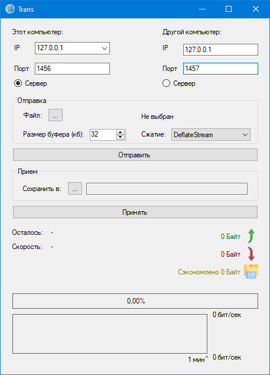
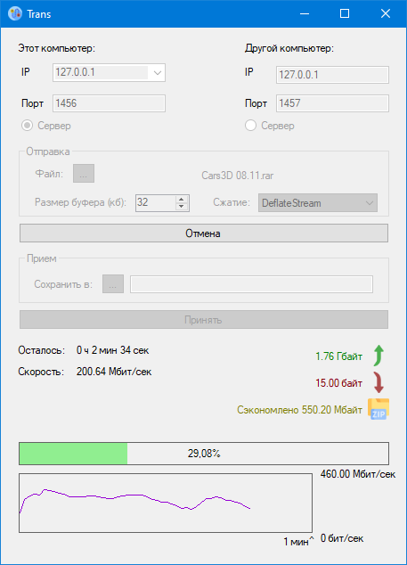

# File-Transporter
Программа для передачи файлов по сети.
Разрабатывалась для локальных нужд

## Функции
- Передача файлов из точки в точку
- Сжатие с использованием DeflateStream или LZMA
- Дозагрузка файла
- График скорости
- Подсчёт сэкономленного трафика
- Расчёт оставшегося времени передачи файла
- Сохранение настроек в папке с программой

## Требования
.NET Framework 4.5

## Скачать программу
[Страница релизов](../../releases)

## Скриншоты
Ожидание:

При передаче:

